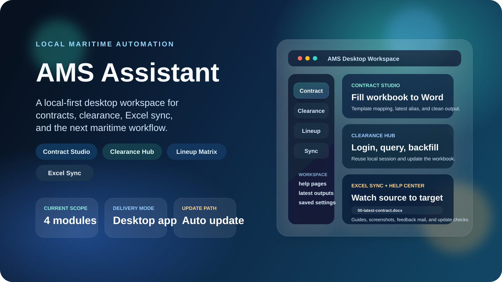
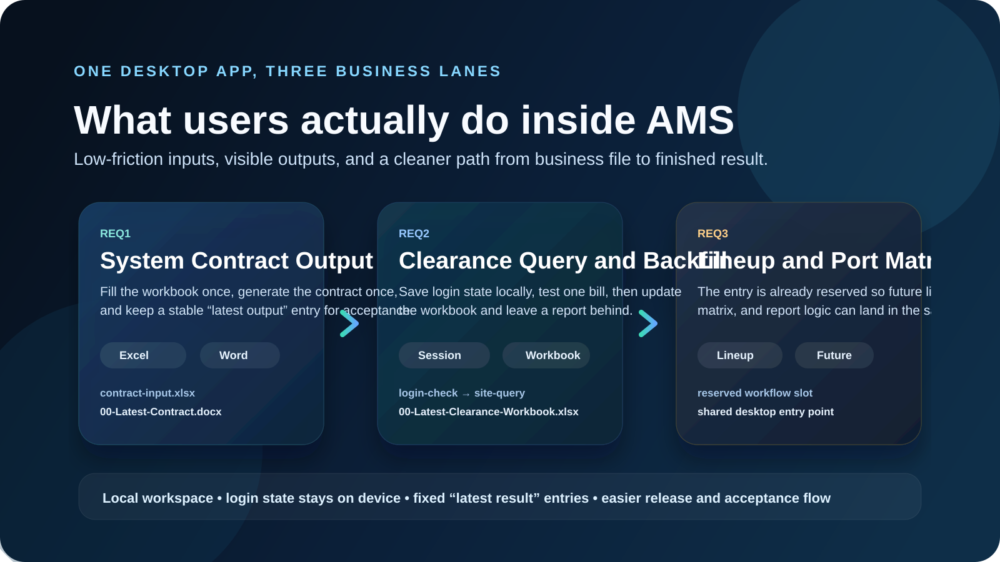

  

<h1 align="center">AMS Assistant for Maritime Service</h1>

  一个面向航运业务团队的本地桌面自动化工作台。 
  把 Excel、Word、网页登录查询、结果回填和后续扩展收进同一个更容易交付、更容易验收的应用里。

  
  
  
  

  <a href="https://github.com/Cyh29hao/AMS-Assistant-for-Maritime-Service/releases"><strong>下载桌面版</strong></a>
  ·
  <a href="./desktop_app/README.md"><strong>桌面版说明</strong></a>
  ·
  <a href="./maritime-service/README.md"><strong>业务脚本层</strong></a>
  ·
  <a href="./docs/public-use/README.md"><strong>公开使用边界</strong></a>

> [!IMPORTANT]
> 这个仓库目前更接近“内部业务自动化原型 + 实施仓库”。它已经可以公开展示、公开下载桌面版、公开评估实现思路，但默认不是“无限制可直接复用的一般化 SaaS 产品”。

## 这是什么

AMS Assistant 不是只会聊天的 copilot，而是一个更偏“本地执行工作台”的工具：

- `合同生成中心`
  在固定 Excel 里填好数据，一键生成 Word 合同。
- `通关查询中心`
  复用本地保存的网站登录态，查询结果并回填业务工作簿。
- `船期与港区矩阵`
  当前先保留入口，后续继续接真实工作流。
- `表格自动同步`
  把源表几乎整张复制到目标 Excel，只排除你指定不保留的列。
- `私密业务包`
  把真实模板、真实站点配置、真实帮助页从公开 release 中分离出来，通过加密包和密码在本机解锁。

## 一眼看懂产品形态

  

## 如果你只是想直接使用

1. 打开 [Releases 页面](https://github.com/Cyh29hao/AMS-Assistant-for-Maritime-Service/releases)
2. 下载最新桌面版压缩包
3. 解压后双击 `1-启动AMS桌面应用.bat`
4. 在桌面应用里进入相应功能页面

你不需要先研究源码结构，也不需要手动拼接脚本命令。

## 当前能力

| 模块 | 普通用户能感受到什么 | 状态 |
| --- | --- | --- |
| `合同生成中心` | 填 Excel，点一次，得到 Word 合同和固定命名的最新结果文件 | 可用 |
| `通关查询中心` | 保存一次登录态后，按提单号批量查询并回填工作表 | 可用 |
| `船期与港区矩阵` | 已保留入口、目录和后续扩展位 | 预留 |
| `表格自动同步` | 配置同步任务后，尽量按源表结构复制到目标表 | 可用 |
| `私密业务包` | 通过 `.amspack` + 密码解锁真实模板和真实配置 | 可用 |

## 仓库结构

| 目录 | 适合谁看 | 作用 |
| --- | --- | --- |
| [`desktop_app/`](./desktop_app/README.md) | 普通用户、产品视角、交付视角 | 桌面 GUI、更新、帮助中心、私密包解锁、打包 |
| [`maritime-service/`](./maritime-service/README.md) | 实施与脚本维护者 | 业务脚本、模板、示例、批处理入口 |
| [`docs/public-use/`](./docs/public-use/README.md) | 准备公开展示的人 | 许可证、脱敏、模板来源、公开/私有拆分方案 |
| [`our_requirements/`](./our_requirements/README.md) | 需求回溯、内部评估 | 历史输入材料，不是对外产品入口 |

## 私密业务包是干什么的

如果你担心“工具公开了，但真实工作内容不该裸露”，这套机制就是为这个问题准备的：

- 公开 release 继续分发桌面应用
- 真实模板和真实配置不再直接跟着公开仓库走
- 内部人只需要拿到一个加密的 `.amspack` 文件和密码
- 你也可以直接在桌面应用里图形化制作 `.amspack`
- 在应用设置页导入后，本机就会进入“已解锁完整业务模式”
- 主程序更新时，私密包默认跟着用户数据保留，不需要每次重装

更详细的公开/私有策略见：
- [公开使用边界总览](./docs/public-use/README.md)
- [公开 / 私有拆分方案](./docs/public-use/public-private-split-plan.md)

## 对外公开前，先看这些边界

- [LICENSE](./LICENSE)
- [数据脱敏说明](./docs/public-use/data-sanitization.md)
- [模板来源说明](./docs/public-use/template-sources.md)
- [账号与站点自动化安全边界](./docs/public-use/automation-security-boundaries.md)
- [历史材料目录说明](./our_requirements/README.md)

## 推荐阅读顺序

### 面向普通用户

1. [Releases 页面](https://github.com/Cyh29hao/AMS-Assistant-for-Maritime-Service/releases)
2. [desktop_app/README.md](./desktop_app/README.md)

### 面向实施与维护

1. [maritime-service/README.md](./maritime-service/README.md)
2. [maritime-service/开始看这里.md](./maritime-service/%E5%BC%80%E5%A7%8B%E7%9C%8B%E8%BF%99%E9%87%8C.md)
3. [maritime-service/docs/00-如何验收这套skill.md](./maritime-service/docs/00-%E5%A6%82%E4%BD%95%E9%AA%8C%E6%94%B6%E8%BF%99%E5%A5%97skill.md)

## 一句话定位

这是一个已经具备“可下载、可演示、可验收、可继续往真实业务推进”的航运业务桌面自动化产品雏形，同时仍然保留了足够完整的实施仓库结构，方便继续扩展新功能和新工作流。
